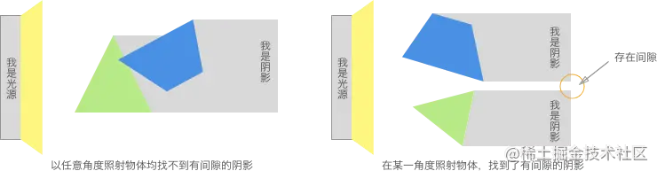
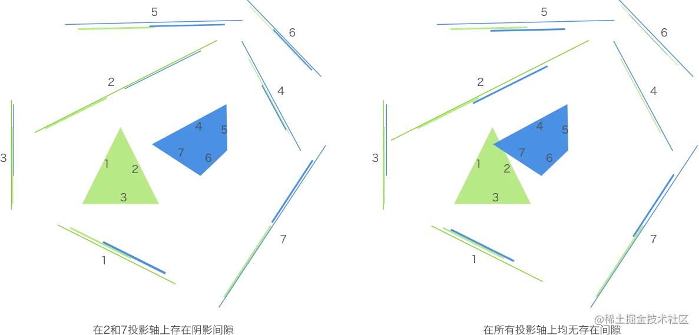
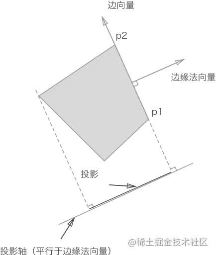
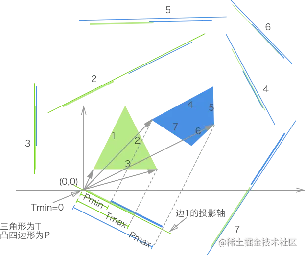
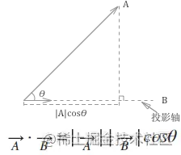
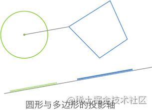

# collision_2d
## 分离轴定理 - Separating Axis Theroem
[参考资料](https://juejin.cn/post/6844903464011579400)
### 概念
通过判断任意两个**凸多边形**在任意角度下的投影是否均存在重叠，来判断是否发生碰撞。

若在某一角度光源下，两个物体的投影存在间隙，则为不碰撞。

否则为发生碰撞


在程序中，遍历所有角度是不现实的。那如何确定**投影轴**呢？

其实**投影轴的数量**与**多边形的边数**相等即可。

### 详解
#### 抽象层次判断两个凸多边形是否碰撞
```js
function polygonsCollide(polygon1, polygon2) {
    var axes, projection1, projection2;

    // 根据两个多边形获取所有投影轴
    axes = polygon1.getAxes();
    axes.push(polygon2.getAxes())

    // 遍历所有投影轴，获取多边形在每条投影轴上的投影
    axes.foreach(axis => {
        projection1 = polygon1.project(axis);
        projection2 = polygon2.project(axis);

        // 判断投影是否存在重叠，若检测到存在间隙则立刻退出判断，消除不必要的运算
        if(projection1.overlaps(projection2)) {
            return false;
        }
    });
    return true;
}
```
### 1. 确定多边形每一条边的投影轴 
我们使用一条从p1指向p2的向量来表示多边形的某条边--**边缘向量**。

在分离轴定理中，还需要确定一条垂直于边缘向量的法向量--**边缘法向量**

**投影轴**平行于边缘法向量。

投影轴的位置不限，因为其长度无限，故而多边形在该轴上的投影是一样的。该轴的方向才是着关键的。


```js
// 以原点(0,0)为起始，顶点为末。最后通过向量减法得到边缘向量。
// 两个顶点向量
var p1 = new Vector(p1.x - 0, p1.y - 0);
var p2 = new Vector(p2.x - 0, p2.y - 0);

// 首先得到边缘向量，然后再通过边缘向量获得相应边缘法向量(单位向量)
// 边缘向量: 两向量相减得到p2p1(x, y)
// 法向量：(x1x2 + y1y2 = 0)可得法向量(-y, x)或(y, -x)
let axis = v1.edge(v2).normal()
```
### 2. 确定投影大小
投影的大小：通过将一个多边形上的每个顶点与原点(0,0)组成的向量，投影在某一投影轴上，然后保留该多边形在该投影轴上所有投影中的最大值和最小值，这样即可表示一个多边形在某投影轴上的投影了。
```js
// 判断现多边形的投影是否重合
projection1.max > projection2.min && projection2.max > projection1.min
```

为了易于理解，示例图将坐标轴原点(0.0)放置于三角形边1投影轴的适当位置

```js
// 用最大和最小值表示某一凸多边形在某一投影轴上的投影位置
var Projection = function(min, max) {
    this.min = min;
    this.max = max;
}

// 判断两投影是否重叠
Projection.prototype.overlaps(projection) {
    return this.max > projection.min && projection.max > this.min;
}
```
### 3. 如何得到向量在投影轴上的长度
向量的点积的其中一个几何含义是：一个向量在平行于另一个向量方向上的投影的数值乘积。
由于投影轴是单位向量（长度为1），投影长度为```x1*x2 + y1 * y2```



```js
// 根据多边形的每个定点，得到投影的最大值和最小值
function project = function (axis) {
    var scalars = [];
    var v = new Vector();

    this.points.forEach(function (point) {
        v.x = point.x;
        v.y = point.y;
        // 各个顶点向量在投影轴上的投影
        scacles.push(v.dotProduct(axis));
    })

    return new Projection(Math.min.apply(Math, scalars), Math.max.apply(Math, scalars));
}
```

### 4. 圆形与多边形之间的碰撞检测
由于圆形可近似看成一个有无数条边的正多边形，而我们不可能按照这些边一一进行投影与测试。

我们只需要将圆形投射到一条投影轴上即可，这条轴就是圆心与多边形顶点中最近的一点的连线。


因此，该投影轴和多边形自身的投影轴就组成了一组待检测的投影轴了。
