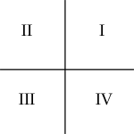
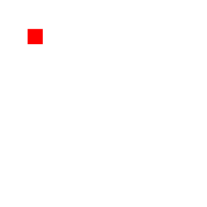
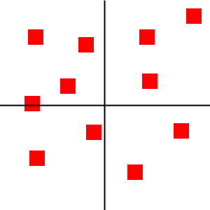
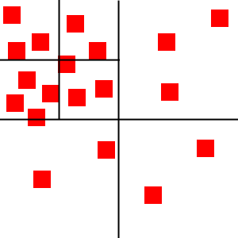

# 2D空间中使用四叉树(QuadTree)进行碰撞检测优化
## 原文链接
[Quick Tip: Use Quadtrees to Detect Likely Collisions in 2D Space](https://gamedevelopment.tutsplus.com/tutorials/quick-tip-use-quadtrees-to-detect-likely-collisions-in-2d-space--gamedev-374)
[2D空间中使用Quadtree四叉树进行碰撞检测优化](2D空间中使用Quadtree四叉树进行碰撞检测优化)
## 思路
使用四叉树来对碰撞检测进行优化，优化的根本是碰撞检测时跳过哪些明显离得很远的物体，加快检测速度。
## 介绍
碰撞检测是一个很耗费资源的操作。假设有100个物体要进行互相的碰撞检测，两两物体的位置比较要进行：100×100=10000次

碰撞检测优化的一个办法是想办法减少检测的次数，例如在屏幕对角的两个物体那么远是不可能碰撞的，所以也就没有必要云判断仓位是否相碰了，四叉树的优化就是基于这一点。
## 四叉树原理
四叉树是二叉树的一个扩展也是一个数据结构，只不过四叉树是有四个子节点。四叉树将2D区域分成多个部分进行划分操作。

在接下来的示例图片中，每张图片代表一个游戏的2D空间，红色的方块代表物体。同时文中的每个区域的子区域(子节点)按照逆时针进行标记，如下:

1. 一个四叉树的开始是一个单一节点(根节点)，根节点对应原本没有分割的2D空间，物体可以添加到2D空间，也就是添加到根节点上:

    

2. 当更多的物体添加到四叉树以后，根节点物体数量太多了就会分裂出4个子节点，将多数物体分到子节点中（处于子节点边界的物体无法加入任何一个子节点就还是留在父节点中）
   
   
3. 同样随着物体数量增加每一个子节点可以继续分裂出自己的四个子节点
   
   

4. 可以看到每个节点只包含少量的物体（不能分给子节点的那些物体）。因此我们知道，在左上节点中的物体是不可能和左下节点中的物体产生碰撞的，因此就不需要在仓位之间进行碰撞检测。

